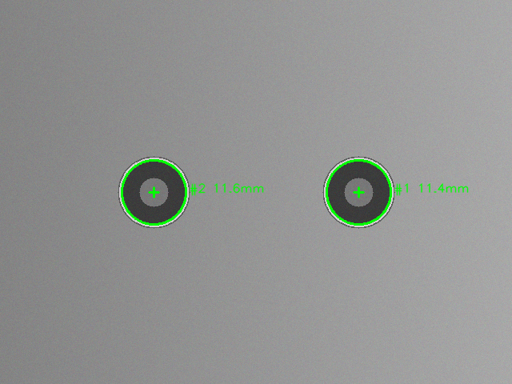
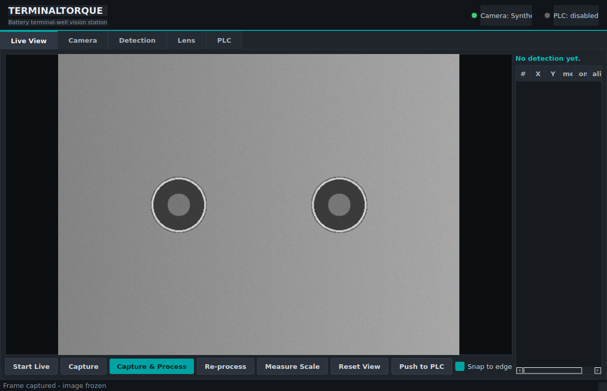
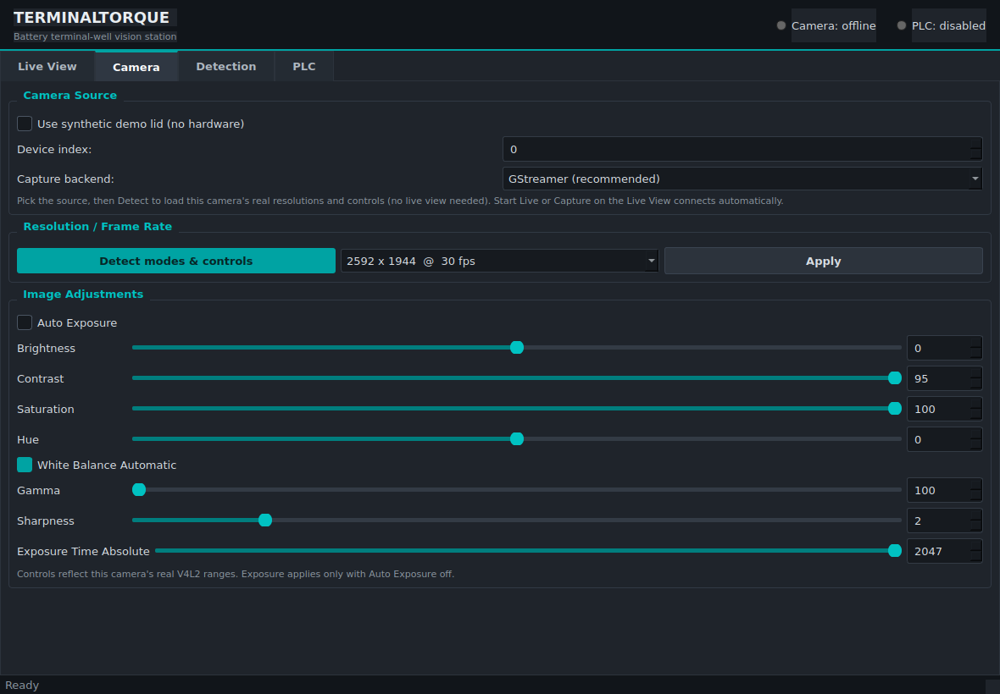
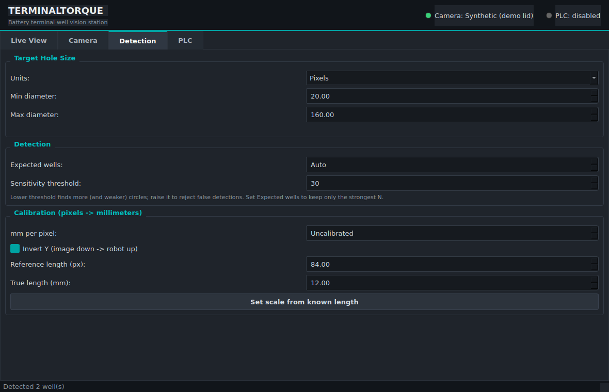
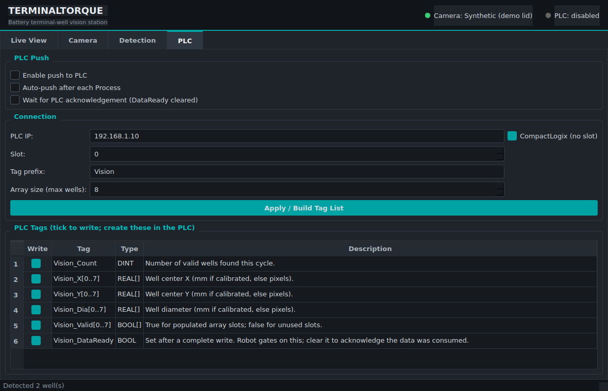
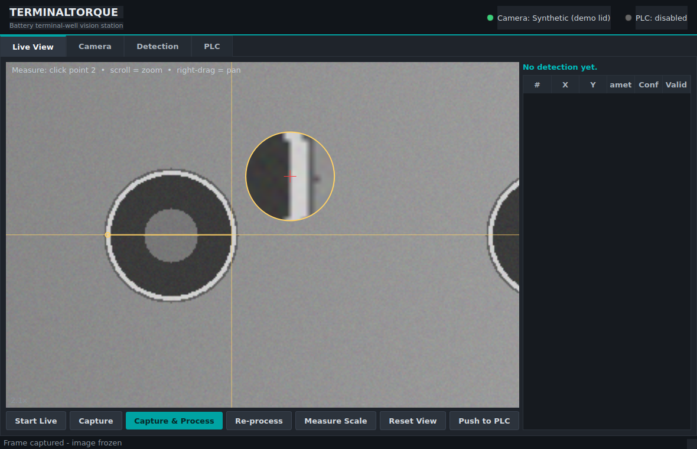

# TerminalTorque

Vision-based detection of **circular terminal wells on a battery lid**. Given a
camera image of the lid, TerminalTorque reports each well's **center** and
**diameter** — in pixels, and in real-world **millimeters** once calibrated — so
a robot can position over each terminal and torque the nut.



## How it works

1. **Grayscale + blur** to suppress sensor noise.
2. **Circularity-scoring Hough transform** (`cv2.HoughCircles` with
   `HOUGH_GRADIENT_ALT`) finds candidates and scores how truly circular each is.
   Unlike the classic transform, it does *not* hallucinate "circles" out of
   text, scratches, and noise — the strictness is the **Circularity** control
   (`--circularity`, default 0.8). The classic transform is still available via
   `--classic` for unusual cases.
3. **Edge-support filter + concentric merge.** Each candidate is verified
   against the real edge map (rejecting any whose rim isn't actually there), and
   a well's outer rim and the post inside it are merged into one detection — the
   well opening the robot torques over.
4. **Sub-pixel center refinement.** The raw Hough center is only accurate to
   ~1 px, which can be a millimeter or more of robot error. Each candidate is
   refined to the intensity-weighted centroid of its edge ring, tightening
   repeatability to a fraction of a pixel on a clean machined well.
5. **Calibration** maps pixel centers and diameters to millimeters in the
   robot's work plane.

## Industrial HMI

A PySide6/Qt operator HMI wraps the whole pipeline. Launch it with:

```bash
pip install -e ".[hmi]"        # adds PySide6
terminaltorque-hmi             # or: python -m terminaltorque.gui
```



Four tabs:

- **Live View** — **Start Live** connects the camera (per the Camera tab's
  source) and streams it; **Capture** a frame, **Capture & Process** to detect
  wells (centers + diameters overlaid, results in a table), **Measure Scale** to
  click-to-calibrate mm-per-pixel on the frozen frame, and **Push to PLC**.
- **Camera** — pick the **Source** (synthetic demo lid, USB/V4L2 camera, or
  **Basler via pypylon**) and, for V4L2, a capture backend. **Detect modes &
  controls** reads the camera's *real* supported resolutions/frame rates and its
  *real* image controls (true ranges) straight from the device. For a V4L2
  camera the sliders are built from the hardware, so exposure is driven through
  the correct `auto_exposure` menu instead of OpenCV's broken normalized
  property (the usual cause of a black image); Basler cameras expose their
  `ExposureTime`/`Gain`/`ExposureAuto` controls the same way.

### Linux camera setup

Real cameras use a V4L2 backend that reads modes and controls via `v4l2-ctl`:

```bash
sudo apt install v4l-utils      # required for real resolutions + image controls
```

### Basler cameras (pypylon)

Basler GigE/USB3 cameras are driven through the Pylon SDK, not V4L2. Install
the wrapper and select **Basler (pypylon)** as the Source on the Camera tab:

```bash
pip install "pypylon>=3.0"      # or: pip install -e ".[basler]"
```

Set the **Device index** (0 for the first camera) and press **Detect modes &
controls** to connect and load the sensor's resolutions and its real exposure /
gain / auto-exposure controls. Frames are converted to BGR automatically;
auto-exposure maps to the camera's `ExposureAuto` mode, and manual exposure to
`ExposureTime`. Everything downstream (detection, calibration, PLC push) is
identical to the other sources.

Capture backend (Camera tab → *Capture backend*, V4L2 sources only):

- **GStreamer (recommended)** — needs an OpenCV built with GStreamer (e.g. the
  distro package `python3-opencv`, or a custom build). The pip
  `opencv-python`/`-headless` wheels are built **without** GStreamer; check with
  `python -c "import cv2; print('GStreamer' in cv2.getBuildInformation())"`.
- **V4L2** — works with the pip OpenCV wheel; the app requests an MJPG stream at
  the selected resolution.

Exposure and the other image controls are set through `v4l2-ctl` on the device
node and work with **either** backend, whether or not a live view is running.
- **Detection** — tell it **what hole size to look for** (min/max diameter in
  pixels or millimeters), the expected well count, and detection sensitivity,
  plus calibration (mm/px, or set it from a known length).
- **Lens** — chessboard **camera calibration** to remove lens distortion so
  off-center circles are located accurately; capture views, calibrate, and
  toggle undistortion (save/load the result).
- **PLC** — enable/disable the push, set the connection, and see every PLC tag
  with its **type and description** and a per-tag write checkbox.

With no camera attached, choose *"Use synthetic demo lid"* on the Camera tab to
exercise the full station — capture, detect, calibrate, and push — entirely in
software.

|  Camera tab | Detection tab | PLC tab |
|---|---|---|
|  |  |  |

## Install

```bash
pip install -r requirements.txt        # runtime (numpy + opencv)
pip install -e ".[dev]"                # editable install + pytest + PLC + HMI
```

## Quick start

Try it with no hardware using the built-in synthetic lid:

```bash
python -m terminaltorque --demo --min-radius 25 --max-radius 70 --expected 2 \
    --mm-per-px 0.1429 --annotate out/demo_annotated.png
```

Detect on a saved photo and keep only the two strongest wells:

```bash
python -m terminaltorque --image lid.png --expected 2
```

Grab a frame from a camera and report results in millimeters:

```bash
python -m terminaltorque --camera 0 --calibration cal.json
```

### Output

JSON to stdout (or `--output file.json`), ready for the robot controller:

```json
{
  "image_size": { "width": 640, "height": 480 },
  "calibrated": true,
  "count": 2,
  "wells": [
    {
      "center_px": [448.22, 239.93],
      "diameter_px": 79.52,
      "confidence": 1.0,
      "refined": true,
      "center_mm": [18.39, -0.06],
      "diameter_mm": 11.36
    }
  ]
}
```

Wells are sorted strongest-first. Exit codes let the robot/operator branch:
`0` = wells found (and the PLC push succeeded if requested), `2` = no wells
detected, `3` = wells detected but the PLC push failed.

## Pushing to an Allen-Bradley PLC

Results can be pushed straight into a Logix PLC (ControlLogix / CompactLogix)
over EtherNet/IP, so the robot program reads center and diameter from tags
instead of parsing JSON. This uses [`pycomm3`](https://pycomm3.dev):

```bash
pip install "pycomm3>=1.2"      # or: pip install -e ".[plc]"

# CompactLogix (no slot), calibrated -> values land in mm:
python -m terminaltorque --camera 0 --expected 2 --calibration cal.json \
    --plc-ip 192.168.1.10

# ControlLogix in slot 0, custom tag prefix, wait for the PLC to acknowledge:
python -m terminaltorque --image lid.png --expected 2 --calibration cal.json \
    --plc-ip 192.168.1.10 --plc-slot 0 --plc-prefix Vision --plc-wait-ack
```

### Tag layout

For `--plc-prefix Vision` and `--plc-max-wells N`, create these tags in the PLC:

| Tag | Type | Meaning |
|-----|------|---------|
| `Vision_Count` | `DINT` | number of valid wells this cycle |
| `Vision_X[0..N-1]` | `REAL[N]` | well center X (mm if calibrated) |
| `Vision_Y[0..N-1]` | `REAL[N]` | well center Y |
| `Vision_Dia[0..N-1]` | `REAL[N]` | well diameter |
| `Vision_Valid[0..N-1]` | `BOOL[N]` | true for populated slots |
| `Vision_DataReady` | `BOOL` | set after a complete write |

### Handshake

The push is ordered so the robot can never latch a half-written result:

1. `Vision_DataReady` is cleared.
2. All geometry is written. **Every** array slot up to `--plc-max-wells` is
   written each cycle — unused slots are zeroed and marked `Valid = false`, so
   the robot never reads stale geometry from a previous part.
3. `Vision_DataReady` is set.

Gate the robot logic on `Vision_DataReady`. With `--plc-wait-ack` the tool
blocks until the PLC **clears** `Vision_DataReady` (its acknowledgement that it
consumed the data), up to `--plc-ack-timeout` seconds.

Wells are sorted strongest-first, so `Vision_X[0]` is the highest-confidence
well. If you need a fixed terminal order (e.g. positive vs. negative post),
sort by `center_mm` on the robot side, or pin it to your fixture geometry.

> **Coordinates:** push with a calibration loaded (`--calibration` or a scale
> option) so the PLC receives millimeters. Without it the tool still pushes, but
> the values are pixels and it prints a warning.

### From code

```python
from terminaltorque import detect_terminal_wells, DetectionParams, Calibration
from terminaltorque.plc import PlcConfig, push_to_plc
from terminaltorque.io_utils import grab_frame

wells = detect_terminal_wells(
    grab_frame(0),
    DetectionParams(min_radius_px=30, max_radius_px=60, expected_count=2),
    calibration=Calibration.load("cal.json"),
)
config = PlcConfig.from_ip("192.168.1.10", slot=0, prefix="Vision", max_wells=8)
status = push_to_plc(wells, config, wait_for_ack=True)
print(status)  # {'written': 2, 'handshake_set': True, 'acked': True}
```

## Calibration

For a flat lid imaged roughly perpendicular to the camera at a fixed working
distance, a single **millimeters-per-pixel** scale plus an origin offset maps
image pixels to the robot plane.

**Easiest (HMI): click-to-measure.** On the **Live View**, press **Measure
Scale**, then click the two ends of a feature whose real size you know (a well
rim, a gauge, a ruler mark). Enter that real length in millimeters when prompted
and the mm-per-pixel scale is set immediately — no detect-first round-trip. The
measurement is taken on the frozen frame, so capture/aim first.

For accurate placement, **scroll to zoom** and **right-drag to pan**; in measure
mode the pointer becomes a full-view crosshair with a **magnifier loupe** (red
reticle = the exact pixel that will be recorded). **Snap to edge** (on by
default) snaps each click to the nearest sub-pixel edge, so points land exactly
on a machined rim. **Reset View** fits the image again.



**Or from a known length on the command line:** measure the pixel size of a
feature whose true size you know (e.g. a gauge or a terminal of known machined
diameter) and save a reusable calibration:

```bash
python -m terminaltorque --image lid.png \
    --set-scale-from-px 84 --known-mm 12.0 \
    --save-calibration cal.json
```

`cal.json` stores `mm_per_px`, the pixel `origin` that maps to robot `(0, 0)`
(defaults to the image's optical center), and `invert_y` (default `true`, since
image rows increase downward while robot Y usually increases upward). Edit the
origin to a fiducial you have taught the robot, or set it directly in code via
`Calibration`.

### Lens calibration (off-center accuracy)

A single mm/px scale assumes a distortion-free pinhole. Real lenses bend the
image, so a circle far from the optical center appears **offset** — its reported
position drifts toward the edges of the frame. The **Lens** tab fixes this with a
standard chessboard calibration:

1. Set the board geometry (inner corners = squares − 1; e.g. a 10×7 board is
   9×6) and the printed square size.
2. Hold the chessboard in front of the camera and press **Capture View** from
   several angles and positions across the field of view (aim for 8–15 views,
   spread to the corners).
3. **Calibrate** — the reprojection error (in pixels) is shown as a quality
   check; under ~1 px is good.
4. Tick **Undistort image**. Every frame is now corrected before detection, so
   off-center wells land correctly and the mm/px scale is valid across the whole
   image. **Save**/**Load** persists the calibration (`.npz`) between sessions.

Calibration views are always taken from the raw (uncorrected) image — that's
what the distortion solve needs.

> This corrects lens distortion. If the camera is also tilted relative to the
> lid (perspective), a homography or full `cv2.calibrateCamera` pose estimate is
> the next step; the detector returns pixel geometry either way, only the
> pixel→world step changes.

## Library use

```python
from terminaltorque import detect_terminal_wells, DetectionParams, Calibration
from terminaltorque.io_utils import load_image

image = load_image("lid.png")
cal = Calibration.load("cal.json")
params = DetectionParams(min_radius_px=30, max_radius_px=60, expected_count=2)

for well in detect_terminal_wells(image, params, calibration=cal):
    x_mm, y_mm = well.center_mm
    print(f"terminal at ({x_mm:.2f}, {y_mm:.2f}) mm, "
          f"diameter {well.diameter_mm:.2f} mm")
```

## Tuning

The most important parameter is the **radius range** (`--min-radius` /
`--max-radius`): set it to your physical well size in pixels to reject spurious
circles from bolt heads, text, or reflections. Then:

- False circles → raise `--circularity` toward 0.95, tighten the radius range,
  or set `--expected N` to keep only the strongest N.
- Missing wells → lower `--circularity` toward 0.6.

In the HMI these are the **Circularity (strictness)**, **Min/Max diameter**, and
**Expected wells** controls on the Detection tab.

## Tests

```bash
pytest
```

Tests run entirely on synthetic lids (no camera needed) and assert detection
count, center accuracy, diameter accuracy, and calibration math.

## Project layout

| File | Purpose |
|------|---------|
| `terminaltorque/detector.py` | Hough detection + sub-pixel refinement |
| `terminaltorque/calibration.py` | Pixel ↔ millimeter mapping |
| `terminaltorque/plc.py` | Push results to an Allen-Bradley Logix PLC |
| `terminaltorque/gui/` | PySide6 industrial HMI (Live / Camera / Detection / PLC) |
| `terminaltorque/io_utils.py` | Load image / grab camera frame |
| `terminaltorque/synthetic.py` | Synthetic lid generator for demos & tests |
| `terminaltorque/cli.py` | Command-line interface |
